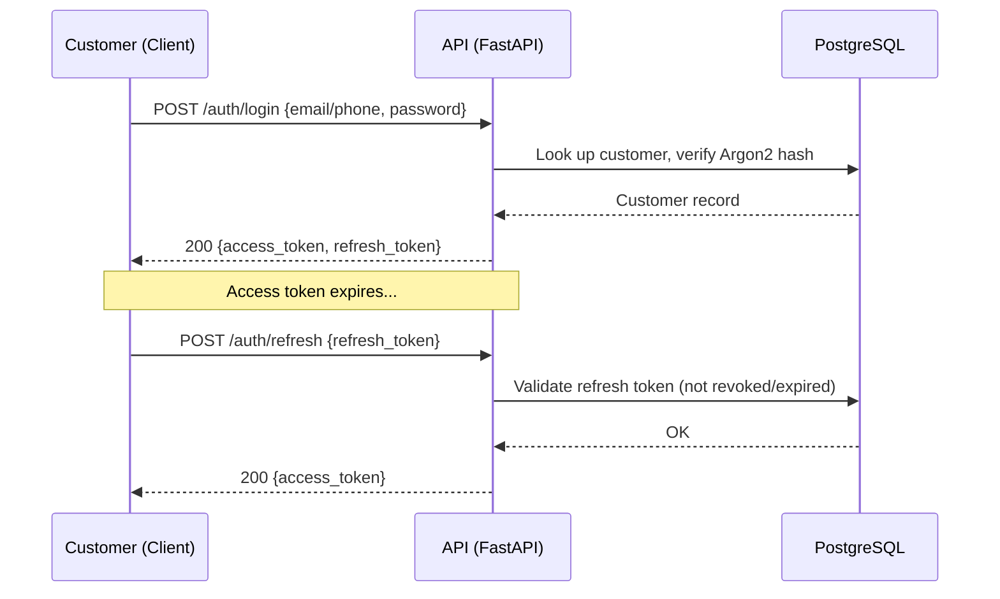
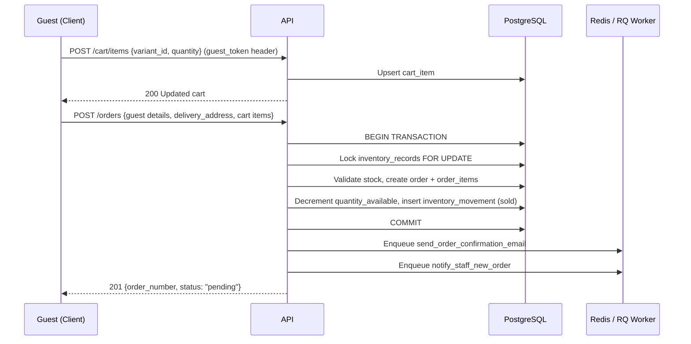
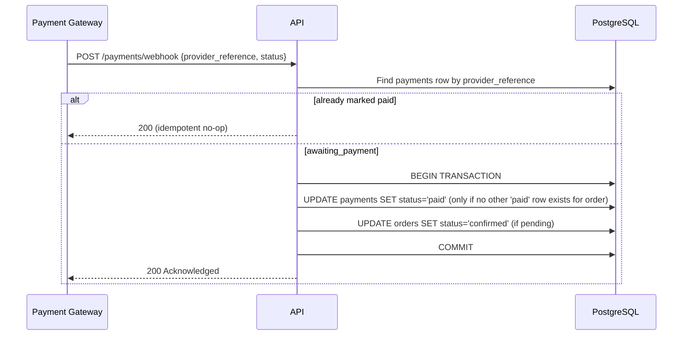
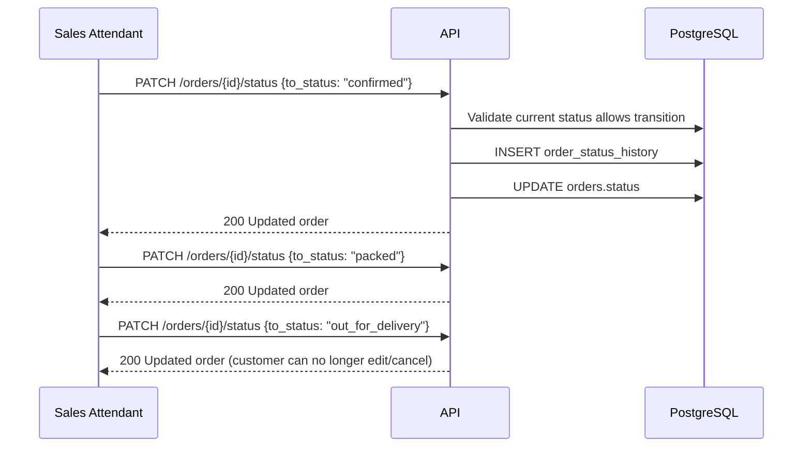

# API Specification

## JN Electronics Online Shopping Platform

**Document Version:** 1.0 (Draft)
**Project:** JN Electronics Online Shopping Platform
**Companion Documents:** SRS v1.0, SAD v1.0, Database Design Document v1.0


---

# Revision History

| Version | Date      | Author | Description                  |
|---------|-----------|--------|--------------------------------|
| 1.0     | July 2026 | —      | Initial API Specification      |

---

# Table of Contents

1. Introduction
2. API Conventions
3. Authentication & Authorization
4. Sequence Diagrams — Key Flows
5. Endpoint Reference
   1. Authentication
   2. Customers
   3. Categories
   4. Products, Variants & Images
   5. Branches
   6. Inventory
   7. Cart
   8. Orders
   9. Payments
   10. Promotions (Banners & Discounts)
   11. Staff Users
   12. Admin Dashboard
   13. Audit Logs
6. Error Code Reference
7. Idempotency & Rate Limiting
8. Appendix — Full Endpoint Index

---

# 1. Introduction

## 1.1 Purpose

This document is the authoritative reference for the REST API exposed by the JN Electronics backend. It defines every endpoint, its authentication requirements, request/response shapes, and error behavior, implementing the API principles set out in SAD §9 and the interface requirements in SRS §4.2.

## 1.2 Scope

Covers all `/api/v1/` endpoints consumed by the React storefront, the administrative dashboard, and future Flutter mobile applications (API-009).

## 1.3 Note on Authoritative Source

Per SAD §9.15, the FastAPI-generated OpenAPI specification is the authoritative, always-current contract. This document is the human-readable companion — if the two ever disagree, the generated OpenAPI spec wins, and this document should be updated to match.

---

# 2. API Conventions

These are inherited directly from SAD §9 and apply to every endpoint below unless explicitly noted.

## 2.1 Base URL & Versioning

```
https://api.jnelectronics.com/api/v1/
```

All endpoints are versioned. Breaking changes introduce a new major version (`/api/v2/`); non-breaking additions stay within `v1`.

## 2.2 Request Format

- All request/response bodies are JSON.
- All field names are `snake_case`.
- All public resource identifiers are UUIDs.

## 2.3 Standard Success Envelope

```json
{
  "success": true,
  "message": "Operation completed successfully.",
  "data": {}
}
```

Collections additionally include a `pagination` object:

```json
{
  "success": true,
  "message": "Products retrieved successfully.",
  "data": [],
  "pagination": {
    "page": 1,
    "page_size": 20,
    "total_records": 250,
    "total_pages": 13
  }
}
```

## 2.4 Standard Error Envelope

```json
{
  "success": false,
  "message": "Validation failed.",
  "error_code": "VALIDATION_ERROR",
  "details": {
    "field": "email"
  }
}
```

## 2.5 HTTP Status Codes

| Code | Meaning              |
|------|-----------------------|
| 200  | Request successful     |
| 201  | Resource created       |
| 204  | Successful, no body    |
| 400  | Bad request             |
| 401  | Authentication required |
| 403  | Access forbidden        |
| 404  | Resource not found      |
| 409  | Conflict                |
| 422  | Validation failed       |
| 429  | Too many requests (future) |
| 500  | Internal server error   |

## 2.6 Pagination

```
GET /products?page=1&page_size=20
```

## 2.7 Filtering & Sorting

```
GET /products?category=headphones&search=oraimo&active=true
GET /products?sort=-created_at
```

A leading `-` denotes descending order. Supported filters are listed per-endpoint below.

## 2.8 Authentication Header

```
Authorization: Bearer <access_token>
```

---

# 3. Authentication & Authorization

## 3.1 Principals

| Principal              | Notes                                                |
|-------------------------|-------------------------------------------------------|
| Guest Customer          | No token; identified by a `guest_token` for cart/checkout |
| Registered Customer     | JWT issued at login/registration                      |
| Sales Attendant         | Staff JWT; limited administrative scope                |
| Inventory Manager       | Staff JWT; full operational scope                      |
| System Administrator    | Staff JWT; seeded account, initial configuration only  |

## 3.2 Tokens

- **Access Token** — short-lived JWT, sent as a Bearer token, required on all protected endpoints.
- **Refresh Token** — longer-lived, used only against `/auth/refresh` to mint a new access token, matching SAD §8.3–8.4.

## 3.3 Role Enforcement

Every protected endpoint below lists the roles permitted to call it. A caller with a valid token but the wrong role receives `403 FORBIDDEN`; a missing/expired/invalid token yields `401 UNAUTHORIZED`.

---

# 4. Sequence Diagrams — Key Flows

## 4.1 Customer Login & Token Refresh



## 4.2 Guest Checkout & Order Placement



## 4.3 Online Payment Confirmation (Gateway Webhook)



## 4.4 Staff Order Fulfillment



---

# 5. Endpoint Reference

## 5.1 Authentication — `/api/v1/auth`

| Method | Path                     | Auth | Description                                      |
|--------|---------------------------|------|-----------------------------------------------------|
| POST   | `/auth/register`          | Public | Register a customer (email or phone + password)  |
| POST   | `/auth/login`              | Public | Customer login                                     |
| POST   | `/auth/staff/login`        | Public | Staff login                                        |
| POST   | `/auth/refresh`            | Public (valid refresh token) | Exchange refresh token for new access token |
| POST   | `/auth/logout`             | Customer/Staff | Revoke active refresh token                 |
| POST   | `/auth/password/forgot`    | Public | Request password reset email                       |
| POST   | `/auth/password/reset`     | Public (valid reset token) | Set new password                    |

**Example — `POST /auth/register`**

Request:
```json
{
  "full_name": "Jane Achieng",
  "email": "jane@example.com",
  "phone_number": "+256700111222",
  "password": "S3cure!Pass"
}
```

Response `201`:
```json
{
  "success": true,
  "message": "Registration successful.",
  "data": {
    "customer": {
      "id": "b1f3...uuid",
      "full_name": "Jane Achieng",
      "email": "jane@example.com",
      "customer_type": "registered",
      "status": "active"
    },
    "access_token": "eyJhbGciOi...",
    "refresh_token": "eyJhbGciOi..."
  }
}
```

**Example — `POST /auth/login`**

Request:
```json
{
  "identifier": "jane@example.com",
  "password": "S3cure!Pass"
}
```

Response `200`:
```json
{
  "success": true,
  "message": "Login successful.",
  "data": {
    "access_token": "eyJhbGciOi...",
    "refresh_token": "eyJhbGciOi..."
  }
}
```

Error `401`:
```json
{
  "success": false,
  "message": "Invalid credentials.",
  "error_code": "UNAUTHORIZED"
}
```

---

## 5.2 Customers — `/api/v1/customers`

| Method | Path                             | Auth                          | Description                              |
|--------|-----------------------------------|--------------------------------|---------------------------------------------|
| GET    | `/customers/me`                    | Registered Customer            | Get own profile                              |
| PATCH  | `/customers/me`                    | Registered Customer            | Update own profile (FR-CUST-002)             |
| PATCH  | `/customers/me/password`           | Registered Customer            | Change own password (FR-CUST-003)            |
| GET    | `/customers/me/orders`              | Registered Customer            | Own order history (FR-CUST-004)              |
| GET    | `/customers`                        | Inventory Manager               | List customers (FR-CUST-005)                 |
| GET    | `/customers/{customer_uuid}`        | Inventory Manager               | View a specific customer (FR-CUST-005/006)   |
| PATCH  | `/customers/{customer_uuid}/status` | Inventory Manager               | Deactivate/reactivate a customer (FR-CUST-007/008) |

**Example — `PATCH /customers/me`**

Request:
```json
{ "full_name": "Jane A. Achieng", "phone_number": "+256700111333" }
```

Response `200`:
```json
{
  "success": true,
  "message": "Profile updated successfully.",
  "data": { "id": "b1f3...uuid", "full_name": "Jane A. Achieng", "phone_number": "+256700111333" }
}
```

---

## 5.3 Categories — `/api/v1/categories`

| Method | Path                              | Auth              | Description                          |
|--------|-------------------------------------|--------------------|-----------------------------------------|
| GET    | `/categories`                        | Public              | List active categories (BR-CAT-002)     |
| GET    | `/categories/{category_uuid}`        | Public              | Category detail                         |
| POST   | `/categories`                         | Inventory Manager    | Create category (FR-PROD-006)           |
| PATCH  | `/categories/{category_uuid}`        | Inventory Manager    | Edit category (FR-PROD-007)             |
| PATCH  | `/categories/{category_uuid}/status` | Inventory Manager    | Deactivate/reactivate (FR-PROD-008)      |

---

## 5.4 Products, Variants & Images — `/api/v1/products`

| Method | Path                                                   | Auth              | Description                                   |
|--------|-----------------------------------------------------------|--------------------|--------------------------------------------------|
| GET    | `/products`                                                 | Public              | Browse/search/filter products (FR-BROWSE-005/006) |
| GET    | `/products/{product_uuid}`                                  | Public              | Product detail (FR-BROWSE-007)                  |
| POST   | `/products`                                                  | Inventory Manager    | Create product (FR-PROD-001)                    |
| PATCH  | `/products/{product_uuid}`                                   | Inventory Manager    | Update product (FR-PROD-002)                    |
| PATCH  | `/products/{product_uuid}/status`                            | Inventory Manager    | Deactivate product (FR-PROD-003/004)             |
| POST   | `/products/{product_uuid}/variants`                          | Inventory Manager    | Add variant (FR-PROD-009)                        |
| PATCH  | `/products/{product_uuid}/variants/{variant_uuid}`           | Inventory Manager    | Update variant / price / SKU (FR-PROD-011)       |
| PATCH  | `/products/{product_uuid}/variants/{variant_uuid}/status`    | Inventory Manager    | Deactivate variant                               |
| POST   | `/products/{product_uuid}/images`                            | Inventory Manager    | Upload image, max 5 (FR-PROD-012)                |
| PUT    | `/products/{product_uuid}/images/{image_uuid}`               | Inventory Manager    | Replace image (FR-PROD-014)                      |
| DELETE | `/products/{product_uuid}/images/{image_uuid}`               | Inventory Manager    | Remove image                                     |
| PATCH  | `/products/{product_uuid}/images/{image_uuid}/primary`       | Inventory Manager    | Set as primary display image (FR-PROD-013)       |

**Query parameters — `GET /products`**

| Param       | Example                | Notes                                  |
|-------------|--------------------------|------------------------------------------|
| `category`  | `?category=headphones`   | Filter by category slug/uuid            |
| `search`    | `?search=oraimo`          | Keyword search on name (FR-PROD-020)    |
| `featured`  | `?featured=true`          | Homepage featured products               |
| `discounted`| `?discounted=true`        | Promotional section (FR-BROWSE-003)     |
| `sort`      | `?sort=-created_at`       | See §2.7                                |
| `page`, `page_size` | `?page=2&page_size=20` | See §2.6                        |

Note: `quantity_available` and branch/inventory fields are **never** included in customer-facing product responses (FR-PROD-017/018). They are visible only through the `/inventory` endpoints below.

**Example — `POST /products`**

Request:
```json
{
  "category_id": "c9a1...uuid",
  "name": "Oraimo FreePods 4",
  "description": "True wireless earbuds with ANC.",
  "is_featured": true,
  "variants": [
    { "sku": "ORM-FP4-BLK", "price": 129000.00, "attributes": { "color": "Black" } },
    { "sku": "ORM-FP4-WHT", "price": 129000.00, "attributes": { "color": "White" } }
  ]
}
```

Response `201`:
```json
{
  "success": true,
  "message": "Product created successfully.",
  "data": {
    "id": "d4e2...uuid",
    "name": "Oraimo FreePods 4",
    "category_id": "c9a1...uuid",
    "is_active": true,
    "variants": [
      { "id": "v1...uuid", "sku": "ORM-FP4-BLK", "price": 129000.00 },
      { "id": "v2...uuid", "sku": "ORM-FP4-WHT", "price": 129000.00 }
    ]
  }
}
```

---

## 5.5 Branches — `/api/v1/branches`

| Method | Path                             | Auth              | Description                          |
|--------|------------------------------------|--------------------|-----------------------------------------|
| GET    | `/branches`                         | Staff                | List branches (FR-BRANCH-001)           |
| GET    | `/branches/{branch_uuid}`           | Staff                | Branch detail                            |
| POST   | `/branches`                          | Inventory Manager     | Create branch (FR-BRANCH-003)            |
| PATCH  | `/branches/{branch_uuid}`           | Inventory Manager     | Update branch (FR-BRANCH-004)            |
| PATCH  | `/branches/{branch_uuid}/status`    | Inventory Manager     | Deactivate branch (FR-BRANCH-005)        |

Branches are never exposed to the customer-facing storefront (FR-BRANCH-007).

---

## 5.6 Inventory — `/api/v1/inventory`

| Method | Path                                                | Auth                                | Description                              |
|--------|--------------------------------------------------------|---------------------------------------|---------------------------------------------|
| GET    | `/inventory`                                             | Sales Attendant, Inventory Manager     | List inventory records, filterable by `branch_id`, `variant_id` (FR-INV-008) |
| GET    | `/inventory/{inventory_record_uuid}`                     | Sales Attendant, Inventory Manager     | Single inventory record detail             |
| PATCH  | `/inventory/{inventory_record_uuid}`                     | Inventory Manager                      | Adjust stock quantity (FR-INV-007)          |
| GET    | `/inventory/{inventory_record_uuid}/movements`           | Sales Attendant, Inventory Manager     | Movement history (FR-INV-010)               |

**Example — `PATCH /inventory/{inventory_record_uuid}`**

Request:
```json
{ "movement_type": "adjustment", "quantity_changed": -3, "reason": "Damaged in storage" }
```

Response `200`:
```json
{
  "success": true,
  "message": "Inventory adjusted successfully.",
  "data": { "id": "ir1...uuid", "quantity_available": 17, "quantity_reserved": 2 }
}
```

Error `409` (would drive quantity negative, violating FR-INV-006):
```json
{
  "success": false,
  "message": "Adjustment would result in negative inventory.",
  "error_code": "INSUFFICIENT_INVENTORY"
}
```

---

## 5.7 Cart — `/api/v1/cart`

Identified by `Authorization` header (registered customer) **or** an `X-Guest-Token` header (guest — FR-CART-007).

| Method | Path                       | Auth                         | Description                                  |
|--------|------------------------------|-------------------------------|--------------------------------------------------|
| GET    | `/cart`                       | Customer or Guest              | Get current cart contents (FR-CART-005)          |
| POST   | `/cart/items`                 | Customer or Guest              | Add item / increments existing line (FR-CART-001/009) |
| PATCH  | `/cart/items/{item_uuid}`     | Customer or Guest              | Update quantity (FR-CART-003)                     |
| DELETE | `/cart/items/{item_uuid}`     | Customer or Guest              | Remove item (FR-CART-002)                          |
| DELETE | `/cart`                       | Customer or Guest              | Clear cart (FR-CART-010)                           |

**Example — `POST /cart/items`**

Request:
```json
{ "variant_id": "v1...uuid", "quantity": 2 }
```

Response `200`:
```json
{
  "success": true,
  "message": "Cart updated.",
  "data": {
    "items": [
      { "id": "ci1...uuid", "variant_id": "v1...uuid", "product_name": "Oraimo FreePods 4", "quantity": 2, "unit_price": 129000.00, "line_total": 258000.00 }
    ],
    "subtotal": 258000.00
  }
}
```

---

## 5.8 Orders — `/api/v1/orders`

| Method | Path                                | Auth                                     | Description                                      |
|--------|---------------------------------------|---------------------------------------------|------------------------------------------------------|
| POST   | `/orders`                              | Customer or Guest                            | Place order from cart (FR-ORDER-001/006)             |
| GET    | `/orders`                              | Customer (own) / Sales Attendant / Inventory Manager (all) | List orders, filterable by `status`, `created_at` |
| GET    | `/orders/{order_uuid}`                 | Owning Customer or Staff                     | Order detail                                          |
| PATCH  | `/orders/{order_uuid}`                 | Owning Customer                              | Edit order (only if not yet "Out for Delivery" — FR-ORDER-010) |
| PATCH  | `/orders/{order_uuid}/cancel`          | Owning Customer or Staff                     | Cancel order (FR-ORDER-011)                           |
| PATCH  | `/orders/{order_uuid}/status`          | Sales Attendant, Inventory Manager           | Advance order status (FR-ORDER-012)                   |
| GET    | `/orders/{order_uuid}/status-history`  | Owning Customer or Staff                     | Status change log (FR-ORDER-013)                       |

**Example — `POST /orders`**

Request:
```json
{
  "guest_full_name": "Peter Okello",
  "guest_phone_number": "+256701234567",
  "guest_email": "peter@example.com",
  "delivery_address": "Plot 14, Kira Road, Kampala",
  "items": [
    { "variant_id": "v1...uuid", "quantity": 1 }
  ]
}
```

Response `201`:
```json
{
  "success": true,
  "message": "Order placed successfully.",
  "data": {
    "id": "o1...uuid",
    "order_number": "JN-20260705-0042",
    "status": "pending",
    "requires_prepayment": false,
    "subtotal": 129000.00,
    "total": 129000.00
  }
}
```

**Example — `PATCH /orders/{order_uuid}/status`**

Request:
```json
{ "to_status": "confirmed", "notes": "Stock verified at Kampala branch" }
```

Response `200`:
```json
{ "success": true, "message": "Order status updated.", "data": { "id": "o1...uuid", "status": "confirmed" } }
```

Error `409` (invalid transition, e.g. `delivered` → `pending`):
```json
{
  "success": false,
  "message": "Cannot transition order from 'delivered' to 'pending'.",
  "error_code": "INVALID_STATE_TRANSITION"
}
```

---

## 5.9 Payments — `/api/v1/payments`

| Method | Path                                | Auth                     | Description                                       |
|--------|---------------------------------------|----------------------------|--------------------------------------------------------|
| POST   | `/orders/{order_uuid}/payments`        | Owning Customer or Staff    | Initiate a payment attempt for an order (FR-PAY-001/002) |
| GET    | `/orders/{order_uuid}/payments`        | Owning Customer or Staff    | List payment attempts for an order                       |
| GET    | `/payments/{payment_uuid}`             | Owning Customer or Staff    | Payment detail                                            |
| POST   | `/payments/webhook`                    | Payment Gateway (signed)    | Gateway callback confirming/failing a payment (PAYINT-002/003) |

**Example — `POST /orders/{order_uuid}/payments`**

Request:
```json
{ "provider": "mobile_money", "amount": 129000.00 }
```

Response `201`:
```json
{
  "success": true,
  "message": "Payment initiated.",
  "data": { "id": "p1...uuid", "status": "awaiting_payment", "provider": "mobile_money" }
}
```

**Example — `POST /payments/webhook`** (idempotent; PAYINT-005)

Request:
```json
{ "provider_reference": "MM-REF-88213", "status": "successful" }
```

Response `200` (first call):
```json
{ "success": true, "message": "Payment confirmed.", "data": { "id": "p1...uuid", "status": "paid" } }
```

Response `200` (duplicate callback — no-op, same result returned):
```json
{ "success": true, "message": "Payment already confirmed.", "data": { "id": "p1...uuid", "status": "paid" } }
```

---

## 5.10 Promotions — Banners & Discounts

| Method | Path                                          | Auth              | Description                              |
|--------|--------------------------------------------------|--------------------|---------------------------------------------|
| GET    | `/banners`                                         | Public              | Active homepage banners (FR-BROWSE-002)     |
| POST   | `/banners`                                          | Inventory Manager    | Create banner (FR-PROMO-002)                 |
| PATCH  | `/banners/{banner_uuid}`                           | Inventory Manager    | Edit banner                                   |
| PATCH  | `/banners/{banner_uuid}/status`                    | Inventory Manager    | Activate/deactivate banner                    |
| POST   | `/products/{product_uuid}/discounts`               | Inventory Manager    | Create discount window (FR-PROD-016)         |
| PATCH  | `/products/{product_uuid}/discounts/{discount_uuid}` | Inventory Manager  | Edit discount                                 |
| PATCH  | `/products/{product_uuid}/discounts/{discount_uuid}/status` | Inventory Manager | Deactivate discount (BR-PROMO-002)     |

---

## 5.11 Staff Users — `/api/v1/staff`

| Method | Path                          | Auth                                | Description                                    |
|--------|---------------------------------|----------------------------------------|----------------------------------------------------|
| GET    | `/staff`                          | Inventory Manager, System Administrator | List staff accounts                                |
| POST   | `/staff`                          | Inventory Manager, System Administrator | Create Sales Attendant / Inventory Manager account (FR-AUTH-010, BR-USER-001/002) |
| PATCH  | `/staff/{staff_uuid}`             | Inventory Manager, System Administrator | Update staff account                                |
| PATCH  | `/staff/{staff_uuid}/status`      | Inventory Manager, System Administrator | Deactivate/reactivate staff account                 |

Sales Attendants cannot call any endpoint in this module (BR-USER-003).

---

## 5.12 Admin Dashboard — `/api/v1/admin`

| Method | Path                              | Auth                              | Description                              |
|--------|--------------------------------------|--------------------------------------|----------------------------------------------|
| GET    | `/admin/dashboard/summary`            | Sales Attendant, Inventory Manager     | Operational summary (FR-ADMIN-001)          |
| GET    | `/admin/dashboard/recent-orders`      | Sales Attendant, Inventory Manager     | Recent orders (FR-ADMIN-004)                 |
| GET    | `/admin/dashboard/low-inventory`      | Inventory Manager                      | Low-stock alerts (FR-ADMIN-005)              |
| GET    | `/admin/dashboard/sales-summary`      | Inventory Manager                      | Sales summary (FR-ADMIN-006)                 |

Sales Attendants only receive the modules they're authorized for (FR-ADMIN-003) — the API filters dashboard widgets server-side by role rather than the client hiding them.

---

## 5.13 Audit Logs — `/api/v1/audit-logs`

| Method | Path             | Auth              | Description                                          |
|--------|--------------------|--------------------|----------------------------------------------------------|
| GET    | `/audit-logs`        | Inventory Manager, System Administrator | List audit entries, filterable by `resource_type`, `resource_id`, `staff_user_id`, date range (FR-AUDIT-001–003) |

Audit logs have no `POST`/`PATCH`/`DELETE` endpoints — they are written internally by the backend, never via direct API calls (FR-AUDIT-004/005).

---

# 6. Error Code Reference

| `error_code`               | HTTP Status | Meaning                                             |
|------------------------------|--------------|--------------------------------------------------------|
| `VALIDATION_ERROR`            | 422          | Request payload failed schema/business validation       |
| `UNAUTHORIZED`                | 401          | Missing, invalid, or expired token                       |
| `FORBIDDEN`                   | 403          | Authenticated but not permitted for this resource         |
| `NOT_FOUND`                   | 404          | Resource does not exist or is not visible to caller       |
| `CONFLICT`                    | 409          | Generic state conflict                                     |
| `INSUFFICIENT_INVENTORY`      | 409          | Requested quantity exceeds available stock (FR-INV-006)    |
| `INVALID_STATE_TRANSITION`    | 409          | Order/payment status change not allowed from current state |
| `DUPLICATE_PAYMENT`           | 409          | A successful payment already exists for this order (BR-PAY-005) |
| `INTERNAL_ERROR`              | 500          | Unhandled server error                                      |

---

# 7. Idempotency & Rate Limiting

- **Payment webhooks** (`/payments/webhook`) are idempotent by `provider_reference`: a repeated callback with the same reference returns the current state without reprocessing (PAYINT-005, SAD §9.14).
- **Payment confirmation** generally should be safe to retry from the client without side effects beyond the first successful call.
- **Rate limiting** (HTTP 429) is a future enhancement per SAD §9.9 / SRS §5.2; not enforced in the Pilot phase.

---

# 8. Appendix — Full Endpoint Index

| Module | Method | Path |
|--------|--------|------|
| Auth | POST | `/auth/register` |
| Auth | POST | `/auth/login` |
| Auth | POST | `/auth/staff/login` |
| Auth | POST | `/auth/refresh` |
| Auth | POST | `/auth/logout` |
| Auth | POST | `/auth/password/forgot` |
| Auth | POST | `/auth/password/reset` |
| Customers | GET | `/customers/me` |
| Customers | PATCH | `/customers/me` |
| Customers | PATCH | `/customers/me/password` |
| Customers | GET | `/customers/me/orders` |
| Customers | GET | `/customers` |
| Customers | GET | `/customers/{customer_uuid}` |
| Customers | PATCH | `/customers/{customer_uuid}/status` |
| Categories | GET | `/categories` |
| Categories | GET | `/categories/{category_uuid}` |
| Categories | POST | `/categories` |
| Categories | PATCH | `/categories/{category_uuid}` |
| Categories | PATCH | `/categories/{category_uuid}/status` |
| Products | GET | `/products` |
| Products | GET | `/products/{product_uuid}` |
| Products | POST | `/products` |
| Products | PATCH | `/products/{product_uuid}` |
| Products | PATCH | `/products/{product_uuid}/status` |
| Products | POST | `/products/{product_uuid}/variants` |
| Products | PATCH | `/products/{product_uuid}/variants/{variant_uuid}` |
| Products | PATCH | `/products/{product_uuid}/variants/{variant_uuid}/status` |
| Products | POST | `/products/{product_uuid}/images` |
| Products | PUT | `/products/{product_uuid}/images/{image_uuid}` |
| Products | DELETE | `/products/{product_uuid}/images/{image_uuid}` |
| Products | PATCH | `/products/{product_uuid}/images/{image_uuid}/primary` |
| Branches | GET | `/branches` |
| Branches | GET | `/branches/{branch_uuid}` |
| Branches | POST | `/branches` |
| Branches | PATCH | `/branches/{branch_uuid}` |
| Branches | PATCH | `/branches/{branch_uuid}/status` |
| Inventory | GET | `/inventory` |
| Inventory | GET | `/inventory/{inventory_record_uuid}` |
| Inventory | PATCH | `/inventory/{inventory_record_uuid}` |
| Inventory | GET | `/inventory/{inventory_record_uuid}/movements` |
| Cart | GET | `/cart` |
| Cart | POST | `/cart/items` |
| Cart | PATCH | `/cart/items/{item_uuid}` |
| Cart | DELETE | `/cart/items/{item_uuid}` |
| Cart | DELETE | `/cart` |
| Orders | POST | `/orders` |
| Orders | GET | `/orders` |
| Orders | GET | `/orders/{order_uuid}` |
| Orders | PATCH | `/orders/{order_uuid}` |
| Orders | PATCH | `/orders/{order_uuid}/cancel` |
| Orders | PATCH | `/orders/{order_uuid}/status` |
| Orders | GET | `/orders/{order_uuid}/status-history` |
| Payments | POST | `/orders/{order_uuid}/payments` |
| Payments | GET | `/orders/{order_uuid}/payments` |
| Payments | GET | `/payments/{payment_uuid}` |
| Payments | POST | `/payments/webhook` |
| Promotions | GET | `/banners` |
| Promotions | POST | `/banners` |
| Promotions | PATCH | `/banners/{banner_uuid}` |
| Promotions | PATCH | `/banners/{banner_uuid}/status` |
| Promotions | POST | `/products/{product_uuid}/discounts` |
| Promotions | PATCH | `/products/{product_uuid}/discounts/{discount_uuid}` |
| Promotions | PATCH | `/products/{product_uuid}/discounts/{discount_uuid}/status` |
| Staff | GET | `/staff` |
| Staff | POST | `/staff` |
| Staff | PATCH | `/staff/{staff_uuid}` |
| Staff | PATCH | `/staff/{staff_uuid}/status` |
| Admin | GET | `/admin/dashboard/summary` |
| Admin | GET | `/admin/dashboard/recent-orders` |
| Admin | GET | `/admin/dashboard/low-inventory` |
| Admin | GET | `/admin/dashboard/sales-summary` |
| Audit | GET | `/audit-logs` |
