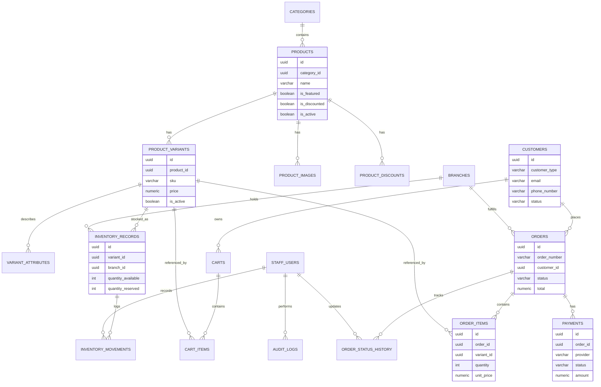

# Database Design Document (DBDD)

## JN Electronics Online Shopping Platform

**Document Version:** 1.0 (Draft)
**Project:** JN Electronics Online Shopping Platform
**Companion Documents:** Software Requirements Specification (SRS) v1.0, System Architecture Document (SAD) v1.0

---

# Revision History

| Version | Date      | Author | Description                          |
|---------|-----------|--------|---------------------------------------|
| 1.0     | July 2026 | —      | Initial Database Design Document      |

---

# Table of Contents

1. Introduction
2. Database Technology Summary
3. Design Conventions
4. Entity Relationship Diagram
5. Entity Definitions
6. Enumerated Types & Status Lifecycles
7. Relationships Summary
8. Indexing Strategy
9. Constraints & Data Integrity
10. Concurrency & Transaction Notes
11. Auditability & Soft Deletion
12. Migration Strategy
13. Assumptions & Design Decisions
14. Appendix — Sample DDL

---

# 1. Introduction

## 1.1 Purpose

This document defines the physical and logical database design for the JN Electronics Online Shopping Platform. It translates the functional requirements in the SRS and the persistence-layer principles in the SAD (§7 Database Architecture) into concrete tables, columns, relationships, constraints, and indexes.

## 1.2 Scope

This document covers the schema for:

- Identity & access (staff users, customers, refresh tokens)
- Catalogue (categories, products, variants, images, discounts)
- Inventory (branches, inventory records, inventory movements)
- Commerce (carts, cart items, orders, order items, order status history, payments)
- Marketing (promotional banners)
- Platform (audit logs, background job metadata)

## 1.3 Intended Audience

Backend developers, database administrators, DevOps engineers, and technical reviewers implementing or maintaining the persistence layer.

---

# 2. Database Technology Summary

| Aspect              | Choice                                   |
|---------------------|-------------------------------------------|
| Database Engine     | PostgreSQL (hosted on Neon)               |
| ORM                 | SQLAlchemy 2.0                            |
| Migration Tool      | Alembic                                   |
| Primary Key Strategy| UUID (v4), surrogate key named `id`       |
| Timestamp Strategy  | `created_at` / `updated_at` (TIMESTAMPTZ) |
| Soft Deletion       | `is_active` boolean flags (no hard deletes for business-critical entities) |

This inherits directly from SAD §3 (Technology Stack) and §7.4 (Naming Conventions): lowercase snake_case, plural table names, `id` primary keys, `<entity>_id` foreign keys.

---

# 3. Design Conventions

- **Tables:** lowercase, snake_case, plural nouns (`products`, `order_items`).
- **Columns:** lowercase, snake_case, descriptive (`created_at`, `order_number`).
- **Primary keys:** every table uses a UUID column named `id`.
- **Foreign keys:** named `<referenced_entity>_id` (e.g. `category_id`, `branch_id`).
- **Monetary values:** `NUMERIC(12,2)` — never floating point.
- **Enumerations:** implemented as PostgreSQL `ENUM` types (or `VARCHAR` + `CHECK` where the value set is expected to evolve).
- **Soft deletion:** business-critical entities (products, categories, branches, customers, orders) are deactivated via `is_active` / `status` flags. Nothing described in the SRS is ever hard-deleted.

---

# 4. Entity Relationship Diagram



---

# 5. Entity Definitions

## 5.1 `staff_users`

Internal accounts for Sales Attendants, Inventory Managers, and the seeded System Administrator (FR-AUTH-010, FR-AUTH-011, BR-USER-001–005).

| Column         | Type          | Constraints                          |
|----------------|---------------|----------------------------------------|
| id             | UUID          | PK                                    |
| full_name      | VARCHAR(150)  | NOT NULL                              |
| email          | VARCHAR(255)  | UNIQUE, NOT NULL                      |
| phone_number   | VARCHAR(20)   | UNIQUE                                |
| password_hash  | VARCHAR(255)  | NOT NULL (Argon2)                     |
| role           | staff_role ENUM | NOT NULL (`system_administrator`, `inventory_manager`, `sales_attendant`) |
| is_active      | BOOLEAN       | NOT NULL, DEFAULT true                |
| created_at     | TIMESTAMPTZ   | NOT NULL, DEFAULT now()               |
| updated_at     | TIMESTAMPTZ   | NOT NULL, DEFAULT now()               |

## 5.2 `customers`

Both guest and registered customers (FR-CUST-001–008, BR-CUST-001–005). Guest customers who never register do **not** need a row here — see §13 for how guest orders are handled.

| Column         | Type          | Constraints                          |
|----------------|---------------|----------------------------------------|
| id             | UUID          | PK                                    |
| customer_type  | customer_type ENUM | NOT NULL (`guest`, `registered`)  |
| full_name      | VARCHAR(150)  |                                        |
| email          | VARCHAR(255)  | UNIQUE (nullable)                     |
| phone_number   | VARCHAR(20)   | UNIQUE (nullable)                     |
| password_hash  | VARCHAR(255)  | NULL for guest customers              |
| status         | customer_status ENUM | NOT NULL, DEFAULT `active` (`active`, `inactive`) |
| created_at     | TIMESTAMPTZ   | NOT NULL, DEFAULT now()               |
| updated_at     | TIMESTAMPTZ   | NOT NULL, DEFAULT now()               |

Registration requires email **or** phone (FR-AUTH-001) — enforced at the application layer, not a DB constraint, to keep the check flexible.

## 5.3 `refresh_tokens`

Supports SAD §8.3–8.4 (Token Architecture, Refresh Token Management).

| Column        | Type        | Constraints                                    |
|---------------|-------------|--------------------------------------------------|
| id            | UUID        | PK                                              |
| owner_type    | owner_type ENUM | NOT NULL (`customer`, `staff`)              |
| owner_id      | UUID        | NOT NULL (polymorphic reference — no DB-level FK) |
| token_hash    | VARCHAR(255)| UNIQUE, NOT NULL                                |
| expires_at    | TIMESTAMPTZ | NOT NULL                                        |
| revoked_at    | TIMESTAMPTZ | NULL                                             |
| created_at    | TIMESTAMPTZ | NOT NULL, DEFAULT now()                         |

## 5.4 `branches`

FR-BRANCH-001–005.

| Column       | Type         | Constraints              |
|--------------|--------------|---------------------------|
| id           | UUID         | PK                        |
| name         | VARCHAR(150) | NOT NULL                  |
| address      | VARCHAR(255) | NOT NULL                  |
| phone_number | VARCHAR(20)  |                           |
| email        | VARCHAR(255) |                           |
| is_active    | BOOLEAN      | NOT NULL, DEFAULT true    |
| created_at   | TIMESTAMPTZ  | NOT NULL, DEFAULT now()   |
| updated_at   | TIMESTAMPTZ  | NOT NULL, DEFAULT now()   |

## 5.5 `categories`

FR-PROD-006–008, BR-CAT-001–003.

| Column      | Type         | Constraints              |
|-------------|--------------|---------------------------|
| id          | UUID         | PK                        |
| name        | VARCHAR(100) | UNIQUE, NOT NULL          |
| description | TEXT         |                           |
| is_active   | BOOLEAN      | NOT NULL, DEFAULT true    |
| created_at  | TIMESTAMPTZ  | NOT NULL, DEFAULT now()   |
| updated_at  | TIMESTAMPTZ  | NOT NULL, DEFAULT now()   |

## 5.6 `products`

FR-PROD-001–021, BR-PROD-001–008.

| Column        | Type          | Constraints                                  |
|---------------|---------------|-------------------------------------------------|
| id            | UUID          | PK                                             |
| category_id   | UUID          | FK → categories.id, NOT NULL                   |
| name          | VARCHAR(200)  | NOT NULL                                       |
| description   | TEXT          |                                                 |
| is_featured   | BOOLEAN       | NOT NULL, DEFAULT false                        |
| is_discounted | BOOLEAN       | NOT NULL, DEFAULT false                        |
| is_active     | BOOLEAN       | NOT NULL, DEFAULT true                         |
| created_at    | TIMESTAMPTZ   | NOT NULL, DEFAULT now()                        |
| updated_at    | TIMESTAMPTZ   | NOT NULL, DEFAULT now()                        |

## 5.7 `product_images`

FR-PROD-012–014, BR-PROD-004–005 (max 5 images, one primary).

| Column               | Type          | Constraints                          |
|----------------------|---------------|----------------------------------------|
| id                   | UUID          | PK                                    |
| product_id           | UUID          | FK → products.id, NOT NULL            |
| image_url            | VARCHAR(500)  | NOT NULL                              |
| cloudinary_public_id | VARCHAR(255)  |                                        |
| is_primary           | BOOLEAN       | NOT NULL, DEFAULT false               |
| display_order        | SMALLINT      | NOT NULL, DEFAULT 0                   |
| created_at           | TIMESTAMPTZ   | NOT NULL, DEFAULT now()               |

Application layer enforces the 5-image cap. A partial unique index enforces exactly one primary image per product (see §9).

## 5.8 `product_variants`

FR-PROD-009–011.

| Column        | Type          | Constraints                          |
|---------------|---------------|----------------------------------------|
| id            | UUID          | PK                                    |
| product_id    | UUID          | FK → products.id, NOT NULL            |
| sku           | VARCHAR(64)   | UNIQUE, NOT NULL                      |
| variant_label | VARCHAR(150)  | Denormalized display label, e.g. "128GB / Midnight Black" |
| price         | NUMERIC(12,2) | NOT NULL                              |
| is_active     | BOOLEAN       | NOT NULL, DEFAULT true                |
| created_at    | TIMESTAMPTZ   | NOT NULL, DEFAULT now()               |
| updated_at    | TIMESTAMPTZ   | NOT NULL, DEFAULT now()               |

## 5.9 `variant_attributes`

Flexible EAV model for variant options (color, capacity, model, or any future attribute) per your request — avoids schema changes when new attribute types are introduced.

| Column          | Type         | Constraints                          |
|-----------------|--------------|----------------------------------------|
| id              | UUID         | PK                                    |
| variant_id      | UUID         | FK → product_variants.id, NOT NULL    |
| attribute_name  | VARCHAR(50)  | NOT NULL (e.g. `color`, `capacity`)   |
| attribute_value | VARCHAR(150) | NOT NULL (e.g. `Midnight Black`, `128GB`) |

`UNIQUE (variant_id, attribute_name)` — a variant cannot define the same attribute twice.

## 5.10 `inventory_records`

FR-INV-001–002, BR-INV-001–002. One row per (variant, branch) pair.

| Column             | Type        | Constraints                              |
|--------------------|-------------|---------------------------------------------|
| id                 | UUID        | PK                                          |
| variant_id         | UUID        | FK → product_variants.id, NOT NULL          |
| branch_id          | UUID        | FK → branches.id, NOT NULL                  |
| quantity_available | INTEGER     | NOT NULL, DEFAULT 0, CHECK (>= 0)           |
| quantity_reserved  | INTEGER     | NOT NULL, DEFAULT 0, CHECK (>= 0)           |
| created_at         | TIMESTAMPTZ | NOT NULL, DEFAULT now()                     |
| updated_at         | TIMESTAMPTZ | NOT NULL, DEFAULT now()                     |

`UNIQUE (variant_id, branch_id)`.

## 5.11 `inventory_movements`

FR-INV-003–011, matching the Inventory Movement Model in the SRS.

| Column              | Type              | Constraints                                       |
|---------------------|-------------------|-----------------------------------------------------|
| id                  | UUID              | PK                                                 |
| inventory_record_id | UUID              | FK → inventory_records.id, NOT NULL                |
| movement_type       | movement_type ENUM| NOT NULL (`stock_in`, `stock_out`, `reserved`, `sold`, `adjustment`) |
| quantity_changed    | INTEGER           | NOT NULL (signed: positive or negative)            |
| reason              | VARCHAR(255)      |                                                     |
| staff_user_id       | UUID              | FK → staff_users.id, NULL (null for system-generated `sold` movements) |
| order_id            | UUID              | FK → orders.id, NULL (set when movement originates from an order) |
| created_at          | TIMESTAMPTZ       | NOT NULL, DEFAULT now()                            |

Immutable — rows are never updated or deleted (mirrors SAD §7.11 Auditability).

## 5.12 `carts`

FR-CART-001–010.

| Column      | Type        | Constraints                                       |
|-------------|-------------|-----------------------------------------------------|
| id          | UUID        | PK                                                 |
| customer_id | UUID        | FK → customers.id, NULL                            |
| guest_token | VARCHAR(100)| UNIQUE, NULL                                       |
| status      | cart_status ENUM | NOT NULL, DEFAULT `active` (`active`, `converted`, `abandoned`) |
| created_at  | TIMESTAMPTZ | NOT NULL, DEFAULT now()                            |
| updated_at  | TIMESTAMPTZ | NOT NULL, DEFAULT now()                            |

`CHECK (customer_id IS NOT NULL OR guest_token IS NOT NULL)` — a cart must belong to either a registered customer or a guest session token.

## 5.13 `cart_items`

FR-CART-004–005, FR-CART-009.

| Column               | Type          | Constraints                          |
|----------------------|---------------|----------------------------------------|
| id                   | UUID          | PK                                    |
| cart_id              | UUID          | FK → carts.id, NOT NULL               |
| variant_id           | UUID          | FK → product_variants.id, NOT NULL    |
| quantity             | INTEGER       | NOT NULL, CHECK (> 0)                 |
| unit_price_snapshot  | NUMERIC(12,2) | NOT NULL                              |
| created_at           | TIMESTAMPTZ   | NOT NULL, DEFAULT now()               |
| updated_at           | TIMESTAMPTZ   | NOT NULL, DEFAULT now()               |

`UNIQUE (cart_id, variant_id)` — enforces FR-CART-009 (update quantity instead of duplicating a line).

## 5.14 `orders`

FR-ORDER-001–015, BR-ORDER-001–010.

| Column               | Type          | Constraints                                          |
|----------------------|---------------|---------------------------------------------------------|
| id                   | UUID          | PK                                                     |
| order_number         | VARCHAR(30)   | UNIQUE, NOT NULL (e.g. `JN-20260701-0001`)             |
| customer_id          | UUID          | FK → customers.id, NULL (null for guest orders)        |
| fulfilling_branch_id | UUID          | FK → branches.id, NULL (assigned internally, FR-BRANCH-008) |
| guest_full_name      | VARCHAR(150)  | NOT NULL                                               |
| guest_phone_number   | VARCHAR(20)   | NOT NULL                                               |
| guest_email          | VARCHAR(255)  |                                                         |
| delivery_address     | VARCHAR(500)  | NOT NULL                                               |
| status               | order_status ENUM | NOT NULL, DEFAULT `pending` (`pending`, `confirmed`, `packed`, `out_for_delivery`, `delivered`, `cancelled`) |
| requires_prepayment  | BOOLEAN       | NOT NULL, DEFAULT false (FR-ORDER-009 / FR-PAY-003)    |
| subtotal             | NUMERIC(12,2) | NOT NULL                                               |
| total                | NUMERIC(12,2) | NOT NULL                                               |
| created_at           | TIMESTAMPTZ   | NOT NULL, DEFAULT now()                                |
| updated_at           | TIMESTAMPTZ   | NOT NULL, DEFAULT now()                                |

Note: `guest_full_name` / `guest_phone_number` are always populated (even for registered customers) as an immutable snapshot of who placed the order (FR-ORDER-005), independent of later changes to the customer's profile.

## 5.15 `order_items`

FR-ORDER-003–004.

| Column                  | Type          | Constraints                          |
|-------------------------|---------------|----------------------------------------|
| id                      | UUID          | PK                                    |
| order_id                | UUID          | FK → orders.id, NOT NULL              |
| variant_id              | UUID          | FK → product_variants.id, NOT NULL    |
| product_name_snapshot   | VARCHAR(200)  | NOT NULL                              |
| variant_label_snapshot  | VARCHAR(150)  |                                        |
| quantity                | INTEGER       | NOT NULL, CHECK (> 0)                 |
| unit_price              | NUMERIC(12,2) | NOT NULL                              |
| line_total              | NUMERIC(12,2) | NOT NULL                              |

Name/label are snapshotted so historical orders remain accurate even if a product is later renamed or deactivated (BR-ORDER-009/010, BR-SOFT-005).

## 5.16 `order_status_history`

FR-ORDER-012–013, Order Status Lifecycle.

| Column              | Type        | Constraints                                |
|---------------------|-------------|-----------------------------------------------|
| id                  | UUID        | PK                                            |
| order_id            | UUID        | FK → orders.id, NOT NULL                      |
| from_status         | VARCHAR(30) | NULL (null on initial creation)               |
| to_status           | VARCHAR(30) | NOT NULL                                      |
| changed_by_staff_id | UUID        | FK → staff_users.id, NOT NULL                 |
| notes               | VARCHAR(500)|                                                |
| created_at          | TIMESTAMPTZ | NOT NULL, DEFAULT now()                       |

Immutable, append-only log; enforces the valid-transition table from the SRS at the application layer.

## 5.17 `payments`

FR-PAY-001–010, BR-PAY-001–007. Modeled as one row **per payment attempt**, since failed attempts must be recorded (FR-PAY-009) alongside a possible later successful one.

| Column             | Type          | Constraints                                       |
|--------------------|---------------|------------------------------------------------------|
| id                 | UUID          | PK                                                 |
| order_id           | UUID          | FK → orders.id, NOT NULL                           |
| provider           | VARCHAR(50)   | NOT NULL (e.g. `mobile_money`, `card`, `cash_on_delivery`) |
| status             | payment_status ENUM | NOT NULL, DEFAULT `pending` (`pending`, `awaiting_payment`, `paid`, `failed`) |
| amount             | NUMERIC(12,2) | NOT NULL                                           |
| currency           | VARCHAR(3)    | NOT NULL, DEFAULT `UGX`                            |
| provider_reference | VARCHAR(150)  |                                                     |
| failure_reason     | VARCHAR(255)  |                                                     |
| initiated_at       | TIMESTAMPTZ   |                                                     |
| completed_at       | TIMESTAMPTZ   |                                                     |
| created_at         | TIMESTAMPTZ   | NOT NULL, DEFAULT now()                            |
| updated_at         | TIMESTAMPTZ   | NOT NULL, DEFAULT now()                            |

A partial unique index `UNIQUE (order_id) WHERE status = 'paid'` enforces BR-PAY-005 (no duplicate successful payments) while still allowing multiple `failed` attempts per order.

## 5.18 `banners`

FR-PROMO-001–003, BR-PROMO-001.

| Column        | Type          | Constraints              |
|---------------|---------------|----------------------------|
| id            | UUID          | PK                         |
| title         | VARCHAR(150)  | NOT NULL                   |
| image_url     | VARCHAR(500)  | NOT NULL                   |
| display_order | SMALLINT      | NOT NULL, DEFAULT 0        |
| is_active     | BOOLEAN       | NOT NULL, DEFAULT true     |
| starts_at     | TIMESTAMPTZ   |                             |
| ends_at       | TIMESTAMPTZ   |                             |
| created_at    | TIMESTAMPTZ   | NOT NULL, DEFAULT now()    |
| updated_at    | TIMESTAMPTZ   | NOT NULL, DEFAULT now()    |

## 5.19 `product_discounts`

FR-PROD-016, FR-PROMO-004–006, BR-PROMO-002–003. Kept as its own table (rather than columns on `products`) so discount history is retained and multiple discount windows can be scheduled independently of the product record.

| Column         | Type          | Constraints                                    |
|----------------|---------------|---------------------------------------------------|
| id             | UUID          | PK                                               |
| product_id     | UUID          | FK → products.id, NOT NULL                       |
| discount_type  | discount_type ENUM | NOT NULL (`percentage`, `fixed_amount`)      |
| discount_value | NUMERIC(12,2) | NOT NULL                                         |
| starts_at      | TIMESTAMPTZ   |                                                   |
| ends_at        | TIMESTAMPTZ   |                                                   |
| is_active      | BOOLEAN       | NOT NULL, DEFAULT true                           |
| created_at     | TIMESTAMPTZ   | NOT NULL, DEFAULT now()                          |
| updated_at     | TIMESTAMPTZ   | NOT NULL, DEFAULT now()                          |

## 5.20 `audit_logs`

FR-AUDIT-001–005, BR-AUDIT-001–004.

| Column          | Type        | Constraints                                    |
|-----------------|-------------|----------------------------------------------------|
| id              | UUID        | PK                                                |
| staff_user_id   | UUID        | FK → staff_users.id, NOT NULL                      |
| action          | VARCHAR(100)| NOT NULL (e.g. `product.update`, `order.status_change`) |
| resource_type   | VARCHAR(100)| NOT NULL (e.g. `product`, `order`, `inventory`)    |
| resource_id     | UUID        | NOT NULL                                          |
| previous_value  | JSONB       | NULL                                              |
| new_value       | JSONB       | NULL                                              |
| created_at      | TIMESTAMPTZ | NOT NULL, DEFAULT now()                            |

No `updated_at` — rows are write-once and never modified or deleted (FR-AUDIT-004/005).

## 5.21 `background_jobs`

Supports SAD §10 (Background Processing) — job metadata persisted for retry and observability (FR-BG-007–008).

| Column      | Type        | Constraints                                       |
|-------------|-------------|-------------------------------------------------------|
| id          | UUID        | PK                                                    |
| job_type    | VARCHAR(100)| NOT NULL (e.g. `send_order_confirmation_email`)       |
| status      | job_status ENUM | NOT NULL, DEFAULT `queued` (`queued`, `running`, `succeeded`, `failed`, `retrying`) |
| payload     | JSONB       |                                                        |
| attempts    | SMALLINT    | NOT NULL, DEFAULT 0                                   |
| last_error  | VARCHAR(500)|                                                        |
| created_at  | TIMESTAMPTZ | NOT NULL, DEFAULT now()                               |
| updated_at  | TIMESTAMPTZ | NOT NULL, DEFAULT now()                               |

---

# 6. Enumerated Types & Status Lifecycles

## 6.1 `order_status`

```
pending → confirmed → packed → out_for_delivery → delivered
pending → cancelled
confirmed → cancelled
```

Matches the SRS Order Status Lifecycle and Valid Order Transitions table exactly. Transition validation is enforced in the application/service layer, not the database.

## 6.2 `payment_status`

```
pending → awaiting_payment → paid
awaiting_payment → failed → awaiting_payment (retry)
```

## 6.3 `movement_type`

`stock_in`, `stock_out`, `reserved`, `sold`, `adjustment` — matches the SRS Inventory Movement Model.

## 6.4 `staff_role`

`system_administrator`, `inventory_manager`, `sales_attendant` — one role per user (BR-USER-004).

---

# 7. Relationships Summary

| Relationship                          | Cardinality  |
|----------------------------------------|--------------|
| Category → Products                    | 1 : N        |
| Product → Product Variants             | 1 : N        |
| Product → Product Images               | 1 : N (max 5, app-enforced) |
| Product → Product Discounts            | 1 : N        |
| Product Variant → Variant Attributes   | 1 : N        |
| Product Variant → Inventory Records    | 1 : N        |
| Branch → Inventory Records             | 1 : N        |
| Inventory Record → Inventory Movements | 1 : N        |
| Customer → Carts                       | 1 : N        |
| Cart → Cart Items                      | 1 : N        |
| Customer → Orders                      | 1 : N        |
| Branch → Orders (fulfillment)          | 1 : N        |
| Order → Order Items                    | 1 : N        |
| Order → Order Status History           | 1 : N        |
| Order → Payments                       | 1 : N        |
| Staff User → Audit Logs                | 1 : N        |

No many-to-many relationships are required by the current SRS; all associations described are naturally one-to-many.

---

# 8. Indexing Strategy

Directly implements SAD §7.8:

| Table                | Indexed Column(s)                     | Purpose                          |
|-----------------------|----------------------------------------|-----------------------------------|
| products              | `name`                                  | Keyword search (FR-BROWSE-005)   |
| products              | `category_id`                           | Category filtering                |
| product_variants      | `sku` (unique)                          | Lookup / uniqueness               |
| orders                | `order_number` (unique)                 | Customer/staff order lookup       |
| orders                | `status`                                | Staff dashboard filtering          |
| orders                | `created_at`                            | Recent orders, reporting           |
| orders                | `customer_id`                           | Customer order history             |
| customers             | `email` (unique), `phone_number` (unique) | Login / lookup                  |
| payments              | `provider_reference`                    | Reconciliation with payment gateway |
| inventory_records     | `branch_id`, `variant_id`               | Stock lookups                      |
| audit_logs            | `(resource_type, resource_id)`          | Audit trail retrieval per record   |

Composite indexes (e.g. `orders(status, created_at)`) can be added once production query patterns are observed, per SAD §7.8.

---

# 9. Constraints & Data Integrity

- All foreign keys enforce referential integrity; `ON DELETE RESTRICT` is used everywhere (nothing in this schema is ever hard-deleted from the referenced side).
- `CHECK (quantity_available >= 0)` and `CHECK (quantity_reserved >= 0)` on `inventory_records` enforce FR-INV-006 / BR-INV-005 at the database level, as a last line of defense behind application logic.
- Partial unique index on `product_images (product_id) WHERE is_primary = true` enforces exactly one primary image per product (BR-PROD-005).
- Partial unique index on `payments (order_id) WHERE status = 'paid'` enforces BR-PAY-005 (no duplicate successful payments) while still permitting multiple failed attempts.
- `UNIQUE (variant_id, branch_id)` on `inventory_records` ensures a single stock record per variant per branch.
- `UNIQUE (cart_id, variant_id)` on `cart_items` enforces FR-CART-009.

---

# 10. Concurrency & Transaction Notes

Per SAD §7.6–7.7:

- Order placement, payment confirmation, and inventory adjustment each execute inside a single database transaction; any failure rolls back the entire operation.
- Inventory decrement on order placement should use `SELECT ... FOR UPDATE` (row-level locking) on the relevant `inventory_records` row to prevent overselling under concurrent checkouts.
- Order status transitions should be guarded by an application-level state check within the same transaction that writes the new `order_status_history` row, so the two never diverge.

---

# 11. Auditability & Soft Deletion

- `audit_logs` is append-only: no `UPDATE` or `DELETE` should ever be issued against it — this should also be enforced with a database-level `REVOKE UPDATE, DELETE` on the application's runtime role, in addition to omitting those operations from the ORM layer.
- `inventory_movements` and `order_status_history` follow the same append-only pattern.
- Products, categories, branches, and customers are deactivated (`is_active` / `status` flag) rather than deleted, per BR-SOFT-001–004. Foreign keys pointing to these tables use `ON DELETE RESTRICT` since rows are never expected to be removed.

---

# 12. Migration Strategy

Per SAD §7.9, all schema changes go through Alembic:

- Every schema change is a version-controlled, forward-only migration.
- Migrations are peer-reviewed and tested in a development environment before being applied to production.
- Enum value additions (e.g. a new `order_status`) are additive migrations; removing or renaming enum values requires a data-backfill migration plan, since PostgreSQL enums are not trivially reorderable/removable.

---

# 13. Assumptions & Design Decisions

These decisions were made to fill gaps not explicitly specified in the SRS/SAD, and are worth reviewing with the team:

1. **Guest checkout without a `customers` row.** Guest orders store the customer's name/phone/email directly on the `orders` row rather than creating a throwaway `customers` record. When a guest later registers with a matching email/phone (FR-AUTH-009), the application layer backfills `orders.customer_id` on the matching historical orders rather than the database doing this automatically.
2. **Guest cart identity.** Guest carts are tracked via an opaque `guest_token` (issued as a cookie or local-storage value) rather than any personally identifying information, since guest customers have no account yet.
3. **Payments as multiple attempts, not one row.** Although BR-PAY-004 says "each order shall have one associated payment record," FR-PAY-009/010 require recording failures while still preventing duplicate successful payments — so the schema allows multiple `payments` rows per order (one per attempt), with a constraint guaranteeing at most one `paid` row.
4. **Variant attributes as EAV**, per your instruction — trades a small query-complexity cost for the ability to add new variant attribute types (e.g. "warranty length") without a schema migration.
5. **Discounts as a separate table** from `products`, so discount history/scheduling doesn't require overwriting a single set of columns on the product row.
6. **`fulfilling_branch_id` is nullable** on `orders` since branch assignment happens after order placement, as an internal operational decision (FR-BRANCH-008).

Please flag any of these that don't match your team's intent — they're the parts of the schema with the most latitude given the current SRS/SAD.

---

# 14. Appendix — Sample DDL

Illustrative excerpt (not exhaustive) showing the conventions applied consistently across the full schema:

```sql
CREATE TYPE order_status AS ENUM (
    'pending', 'confirmed', 'packed', 'out_for_delivery', 'delivered', 'cancelled'
);

CREATE TABLE orders (
    id UUID PRIMARY KEY DEFAULT gen_random_uuid(),
    order_number VARCHAR(30) UNIQUE NOT NULL,
    customer_id UUID REFERENCES customers(id) ON DELETE RESTRICT,
    fulfilling_branch_id UUID REFERENCES branches(id) ON DELETE RESTRICT,
    guest_full_name VARCHAR(150) NOT NULL,
    guest_phone_number VARCHAR(20) NOT NULL,
    guest_email VARCHAR(255),
    delivery_address VARCHAR(500) NOT NULL,
    status order_status NOT NULL DEFAULT 'pending',
    requires_prepayment BOOLEAN NOT NULL DEFAULT false,
    subtotal NUMERIC(12,2) NOT NULL,
    total NUMERIC(12,2) NOT NULL,
    created_at TIMESTAMPTZ NOT NULL DEFAULT now(),
    updated_at TIMESTAMPTZ NOT NULL DEFAULT now()
);

CREATE INDEX idx_orders_status ON orders(status);
CREATE INDEX idx_orders_created_at ON orders(created_at);

CREATE UNIQUE INDEX idx_payments_one_paid_per_order
    ON payments(order_id)
    WHERE status = 'paid';
```

Full DDL will be generated from the SQLAlchemy models via Alembic's autogenerate, then reviewed and adjusted per §12.
