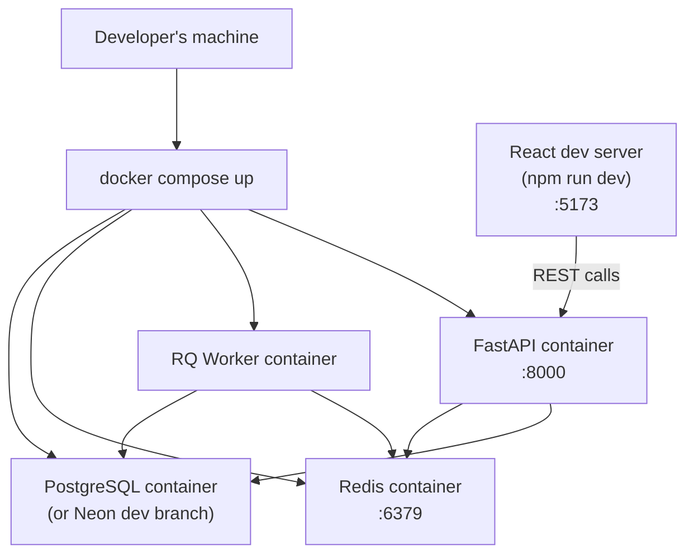
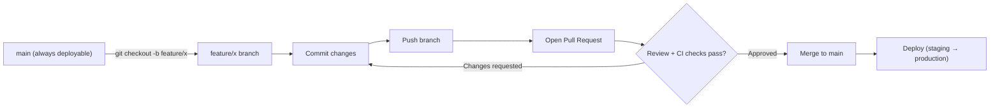

# Developer Documentation

## JN Electronics Online Shopping Platform

**Document Version:** 1.0 (Draft)
**Project:** JN Electronics Online Shopping Platform
**Companion Documents:** SRS v1.0, SAD v1.0, Database Design Document v1.0, API Specification v1.0

---

# Revision History

| Version | Date      | Author | Description                    |
|---------|-----------|--------|-----------------------------------|
| 1.0     | July 2026 | —      | Initial Developer Documentation    |

---

# Table of Contents

1. Introduction
2. Getting Started
3. Repository Structure
4. Backend Development Guide
5. Frontend Development Guide
6. Coding Standards & Conventions
7. Git Workflow
8. Testing Strategy
9. API Consumption Guidelines
10. Environment Variables Reference
11. Common Development Tasks
12. Troubleshooting
13. Contribution & Pull Request Checklist

---

# 1. Introduction

## 1.1 Purpose

This guide gets a developer from a fresh checkout to a running local environment, and documents the conventions the JN Electronics codebase follows so contributions stay consistent with the System Architecture Document (SAD).

## 1.2 Scope

Covers backend (FastAPI) and frontend (React) development, local environment setup, coding standards, Git workflow, and testing.

## 1.3 Intended Audience

Backend developers, frontend developers, and anyone onboarding onto the project — including future contributors to the planned Flutter mobile apps, who should still read §4 (backend) since they'll consume the same API.

---

# 2. Getting Started

## 2.1 Prerequisites

| Tool           | Version (minimum) | Purpose                     |
|-----------------|---------------------|--------------------------------|
| Docker & Docker Compose | Latest stable | Local environment (SAD §13.3) |
| Python          | 3.11+                | Backend (if running outside Docker) |
| Node.js         | 20+                  | Frontend tooling               |
| Git             | Latest stable         | Version control                |

## 2.2 Clone the Repository

```bash
git clone https://github.com/jn-electronics/jn-electronics-platform.git
cd jn-electronics-platform
```

## 2.3 Configure Environment Variables

Copy the example environment files and fill in local values (see §10 for the full reference):

```bash
cp backend/.env.example backend/.env
cp frontend/.env.example frontend/.env
```

Never commit `.env` files — this is a hard rule from SAD §13.5/13.8.

## 2.4 Start the Local Environment

```bash
docker compose up --build
```

This brings up the FastAPI API, the RQ worker, Redis, and (unless you point `DATABASE_URL` at a Neon development branch) a local PostgreSQL instance.

## 2.5 Run Database Migrations

```bash
docker compose exec api alembic upgrade head
```

## 2.6 Seed the Initial System Administrator

Per FR-AUTH-011, the platform ships with exactly one seeded System Administrator account, created via a one-off script rather than the API (since no account yet has permission to create it):

```bash
docker compose exec api python -m scripts.seed_admin
```

## 2.7 Start the Frontend

```bash
cd frontend
npm install
npm run dev
```

## 2.8 Verify Everything Is Running

| Service            | URL                              |
|----------------------|-------------------------------------|
| Frontend             | http://localhost:5173               |
| Backend API           | http://localhost:8000/api/v1         |
| Interactive API docs  | http://localhost:8000/docs (Swagger, SAD §9.15) |
| Alternative API docs  | http://localhost:8000/redoc          |

## 2.9 Local Environment Diagram



---

# 3. Repository Structure

Per SAD Appendix F:

```
jn-electronics-platform/
├── backend/
│   ├── app/
│   ├── tests/
│   ├── alembic/
│   ├── scripts/
│   ├── requirements/
│   ├── Dockerfile
│   └── docker-compose.yml
│
├── frontend/
│   ├── src/
│   ├── public/
│   ├── package.json
│   └── Dockerfile
│
├── docs/
│   ├── proposal/
│   ├── srs/
│   ├── sad/
│   ├── api/
│   ├── database/
│   ├── deployment/
│   ├── developer-guide/
│   └── user-manual/
│
├── .github/
│
└── README.md
```

---

# 4. Backend Development Guide

## 4.1 Module Organization (SAD §5.2)

```
app/
├── core/            # config, security, logging, exceptions
├── db/              # session, base, migrations
├── modules/         # one folder per business domain
│   ├── auth/
│   ├── users/
│   ├── branches/
│   ├── categories/
│   ├── products/
│   ├── inventory/
│   ├── cart/
│   ├── orders/
│   ├── payments/
│   ├── promotions/
│   ├── dashboard/
│   └── audit/
├── integrations/    # cloudinary, email, payment, storage
├── workers/         # email_worker, payment_worker, promotion_worker, cleanup_worker
├── middleware/
├── utils/
└── main.py
```

Each module under `modules/` owns its own routers, Pydantic schemas, services, and repositories. Cross-module logic belongs in a service, never directly in another module's repository.

## 4.2 Layer Responsibilities (SAD §5.3)

| Layer         | Responsible for                                         | Must NOT do                          |
|----------------|------------------------------------------------------------|------------------------------------------|
| API (router)   | Parse/validate request, call service, format response       | Contain business logic                    |
| Service        | Business rules, workflow orchestration, coordinating repositories & background jobs | Know about HTTP request/response objects |
| Repository     | CRUD, query composition, transaction boundaries              | Contain business rules                    |
| Database       | SQLAlchemy models, sessions, Alembic migrations               | —                                          |
| Integration    | Wrap external vendor APIs (Cloudinary, email, payment)        | Be called directly from a router           |

## 4.3 Adding a New Feature — Backend Checklist

1. Create `app/modules/<feature>/` with `router.py`, `schemas.py`, `service.py`, `repository.py`, `models.py`.
2. Define SQLAlchemy model(s) in `models.py`; generate a migration:
   ```bash
   alembic revision --autogenerate -m "add <feature> table"
   alembic upgrade head
   ```
3. Define Pydantic request/response schemas in `schemas.py` (snake_case fields, per SAD §9.6).
4. Implement business logic in `service.py` — this is where FR/BR rule enforcement lives, not the router.
5. Implement persistence in `repository.py`.
6. Wire the router into `app/main.py` under the versioned prefix `/api/v1/`.
7. Add tests (see §8).
8. Update the API Specification document with the new endpoint(s).

## 4.4 Dependency Injection (SAD §5.5)

Use FastAPI's `Depends()` for: DB sessions, the authenticated user/role context, services, config, logging, and integration clients. Services should receive dependencies through constructor/function injection — never instantiate a repository or integration client directly inside a service method.

## 4.5 Error Handling (SAD §5.6)

All exceptions are caught by centralized exception handlers and transformed into the standard error envelope (see API Specification §2.4). When raising a business-rule violation in a service, raise a typed exception (e.g. `InsufficientInventoryError`) rather than returning an HTTP status code directly — the API layer maps exception types to status codes and `error_code` values.

## 4.6 Transactions (SAD §5.9)

Wrap multi-entity writes (order creation, inventory deduction, payment confirmation, product + image creation) in a single transaction at the service layer. Let the transaction roll back automatically on any exception — don't swallow exceptions mid-transaction.

## 4.7 Configuration (SAD §5.8)

All configuration is read from environment variables via `app/core/config.py` (a Pydantic `Settings` object). Never hardcode credentials, URLs, or secrets in code.

---

# 5. Frontend Development Guide

## 5.1 Project Structure (SAD §6.2)

```
src/
├── api/           # centralized API service layer
├── assets/
├── components/
│   ├── common/
│   ├── forms/
│   ├── layout/
│   └── ui/
├── features/      # auth, products, cart, checkout, orders, promotions, admin
├── hooks/
├── layouts/
├── pages/
├── routes/
├── services/
├── store/
├── styles/
├── types/
├── utils/
└── main.jsx
```

## 5.2 State Management (SAD §6.5)

| Concern                          | Tool          |
|------------------------------------|-----------------|
| Server state (API data, caching, refetching) | TanStack Query |
| Client state (auth session, cart UI, sidebar, temp UI state) | Zustand        |

Don't put server-fetched data into Zustand — that's TanStack Query's job. Don't reach for TanStack Query for purely local UI toggles.

## 5.3 API Communication (SAD §6.6)

All HTTP calls go through the centralized service layer in `src/api/`. No component should call `fetch`/`axios` directly. The service layer is responsible for attaching the `Authorization` header, refreshing an expired access token transparently, and mapping error envelopes into a consistent shape the UI can render.

## 5.4 Routing (SAD §6.4)

Routes are grouped into Public, Customer Protected, and Administrative Protected. Protected routes check auth state and role before rendering — implement this as a route guard/wrapper, not per-page ad hoc checks.

## 5.5 Forms (SAD §6.8)

Mirror backend validation rules client-side where practical, but always treat the server's `422 VALIDATION_ERROR` response as the source of truth — display its `details` alongside/instead of client-side errors.

---

# 6. Coding Standards & Conventions

Extending SAD Appendix E:

## Backend

- Follow PEP 8. Use type hints on all function signatures.
- Business logic stays in the service layer; repositories stay dumb.
- Modules are self-contained — avoid importing another module's repository directly; go through its service if cross-module data is needed.
- One Alembic migration per logical schema change; never edit a migration that's already been merged to `main`.

## Frontend

- Components are function components with hooks; no class components.
- Keep business logic out of presentational (`components/ui`) components — push it into `features/<feature>/` hooks or services.
- Co-locate a feature's components, hooks, and API calls under `features/<feature>/`.

## API

- RESTful resource naming, plural nouns, URI versioning (`/api/v1/`).
- Every endpoint returns the standard success/error envelope — see API Specification §2.3–2.4.
- New endpoints must be added to the API Specification document in the same PR.

## Database

- Descriptive snake_case table/column names; `id` for primary keys; `<entity>_id` for foreign keys.
- Every schema change goes through Alembic — never hand-edit the production schema.
- Business-critical entities are deactivated (`is_active`), never hard-deleted.

---

# 7. Git Workflow

The team uses **GitHub Flow**: short-lived feature branches off `main`, opened as a Pull Request, reviewed, then merged.

## 7.1 Branch Naming

```
feature/<short-description>     e.g. feature/cart-guest-checkout
fix/<short-description>         e.g. fix/inventory-negative-stock
chore/<short-description>       e.g. chore/upgrade-sqlalchemy
```

## 7.2 Workflow



## 7.3 Pull Request Expectations

- Small, focused PRs over large ones.
- PR description references the relevant FR/BR/UC identifier from the SRS where applicable (e.g. "Implements FR-ORDER-011").
- At least one reviewer approval required before merge.
- CI (tests + lint) must pass before merge.

## 7.4 Commit Messages

Use imperative, present-tense messages: `Add inventory adjustment endpoint`, not `Added` or `Adding`.

---

# 8. Testing Strategy

## 8.1 Backend — pytest

```
backend/
└── tests/
    ├── unit/            # service-layer logic, no DB/network
    ├── integration/      # repository + DB (test database/transaction rollback per test)
    └── api/              # endpoint tests via FastAPI TestClient
```

Run the suite:

```bash
docker compose exec api pytest
docker compose exec api pytest --cov=app --cov-report=term-missing
```

Guidelines:

- Unit test business rules directly on the service layer (e.g. order status transition validation) without spinning up the full API.
- Integration tests should run against a disposable test database/schema, with each test wrapped in a transaction that's rolled back afterward.
- Every new endpoint needs at least a happy-path and a permission-denied test.

## 8.2 Frontend — Vitest / Jest

```
frontend/
└── src/
    └── features/<feature>/
        └── __tests__/
```

Run the suite:

```bash
npm run test
npm run test -- --coverage
```

Guidelines:

- Unit test hooks and utility functions in isolation.
- Component tests (React Testing Library) should test behavior (what the user sees/does), not implementation details.
- Mock the API service layer at the module boundary rather than mocking `fetch` deep inside a component.

## 8.3 What Must Be Tested Before Merge

- Any new business rule (FR-/BR- prefixed requirement) touched by the change.
- Any new endpoint: request validation, success response, and at least one error case.
- Any inventory- or payment-related change: concurrency-sensitive paths (§ SAD 7.7) deserve extra scrutiny even if hard to fully automate.

---

# 9. API Consumption Guidelines

For any code calling the backend (frontend, future mobile apps, scripts):

- Base path is always `/api/v1/` — see the API Specification document for the full endpoint reference.
- Every response follows the standard envelope (`success`, `message`, `data`, optional `pagination`) — don't assume a bare JSON body.
- Every error follows the standard error envelope with an `error_code` — branch UI/logic on `error_code`, not on the `message` string (messages may be reworded without notice).
- Access tokens go in `Authorization: Bearer <token>`; on a `401`, attempt a silent refresh via `/auth/refresh` once before forcing re-login.
- Guest cart/checkout flows use the `X-Guest-Token` header instead of `Authorization`.

---

# 10. Environment Variables Reference

| Variable                  | Component | Description                                  |
|-----------------------------|-------------|--------------------------------------------------|
| `DATABASE_URL`               | Backend      | PostgreSQL connection string (Neon or local)       |
| `REDIS_URL`                  | Backend      | Redis connection string (job queue)                 |
| `JWT_SECRET_KEY`             | Backend      | Signing key for access/refresh tokens               |
| `JWT_ACCESS_TOKEN_EXPIRE_MINUTES` | Backend | Access token lifetime                              |
| `JWT_REFRESH_TOKEN_EXPIRE_DAYS`   | Backend | Refresh token lifetime                             |
| `CLOUDINARY_URL`             | Backend      | Cloudinary credentials for media storage             |
| `EMAIL_PROVIDER_API_KEY`     | Backend      | Transactional email provider credentials              |
| `PAYMENT_PROVIDER_API_KEY`   | Backend      | Payment gateway credentials                           |
| `ENVIRONMENT`                | Backend      | `development` \| `staging` \| `production`           |
| `VITE_API_BASE_URL`          | Frontend     | Base URL the frontend targets                         |

None of these are ever committed to source control (SAD §13.5, §13.8) — each environment supplies its own values through the deployment platform's secret management.

---

# 11. Common Development Tasks

## 11.1 Add a New Product Field

1. Add the column via an Alembic migration.
2. Update the SQLAlchemy model, Pydantic schemas, and service validation.
3. Update the API Specification's request/response examples for `/products`.
4. Update frontend types and the relevant form component.

## 11.2 Add a New Order Status Transition

1. Update the transition table enforcement in `orders/service.py`.
2. Add a test covering the new transition and its inverse (should still be rejected unless explicitly allowed).
3. Update the Order Status Lifecycle diagram in the SRS/API Specification if the change is business-visible.

## 11.3 Add a Background Job

1. Add a handler in `app/workers/`.
2. Enqueue it from the relevant service method — never enqueue directly from a router.
3. Ensure failures are logged and retried per SAD §10.6.

---

# 12. Troubleshooting

| Symptom                                      | Likely Cause                                    | Fix                                             |
|-------------------------------------------------|----------------------------------------------------|------------------------------------------------------|
| `alembic upgrade head` fails                     | Migration conflict from an unmerged branch            | Rebase on `main`, regenerate migration if needed        |
| API returns `500` with no detail                 | Unhandled exception, check `docker compose logs api` | Add a typed exception + handler for that failure case  |
| Frontend gets `401` on every request              | Expired/missing access token, or clock skew           | Check token expiry config; confirm refresh flow fires   |
| Inventory adjustment rejected                     | Would drive `quantity_available` negative (by design) | Confirm the adjustment amount; this is FR-INV-006      |
| Docker Compose can't reach Postgres               | Local Postgres container not healthy yet               | `docker compose logs db`; wait for healthcheck          |

---

# 13. Contribution & Pull Request Checklist

Before opening a PR:

- [ ] Code follows the conventions in §6.
- [ ] New/changed business logic has corresponding pytest/Vitest tests.
- [ ] New/changed endpoints are reflected in the API Specification document.
- [ ] New/changed tables/columns are reflected in the Database Design Document.
- [ ] No secrets or `.env` files included in the diff.
- [ ] PR description references the relevant SRS requirement ID(s) where applicable.
- [ ] CI (lint + tests) passes.
